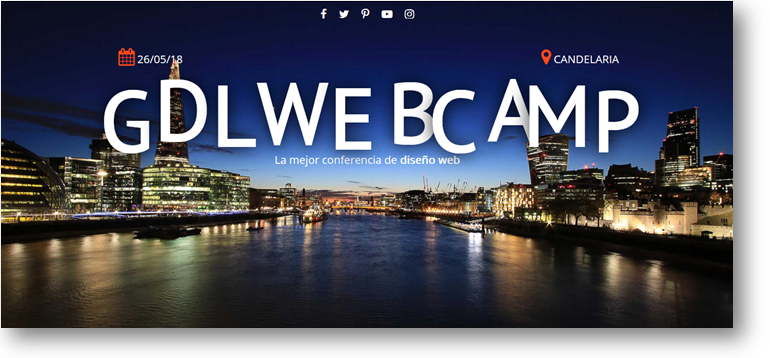
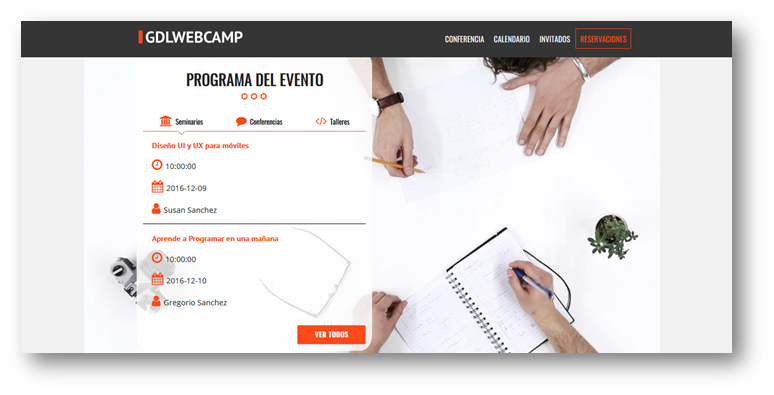
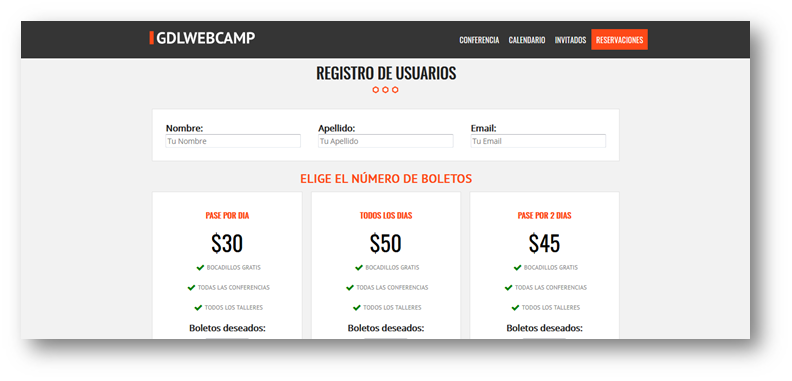
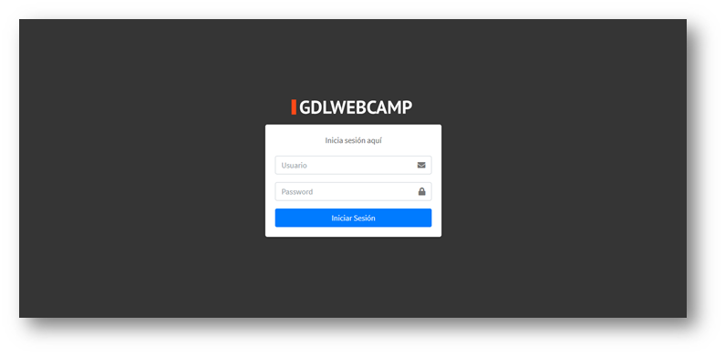
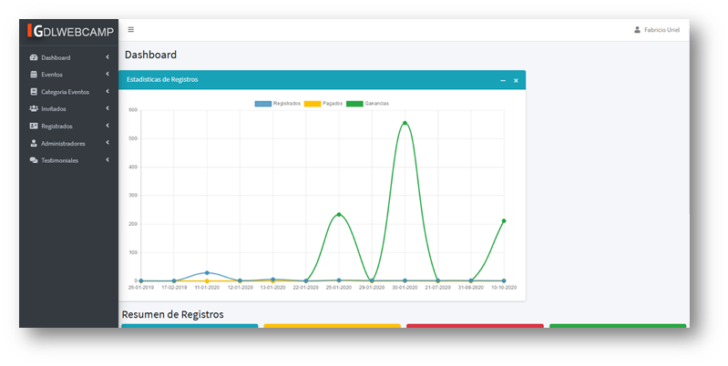
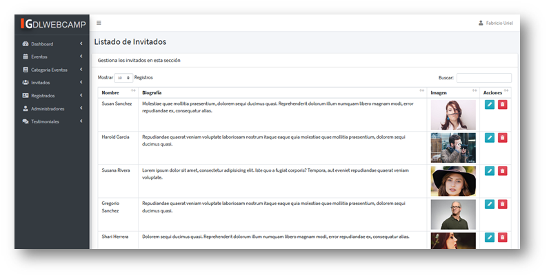

# Sitio web de ventas de boletos para la asistencia a eventos
En este sitio web se podrá adquirir boletos para distintos tipos de eventos como Talleres, Conferencias y Seminarios realizando el [**pago con Paypal**](https://developer.paypal.com/docs/api/rest-sdks/).
<br>
En el sitio se podrá observar los invitados a los eventos, una galería de eventos ya realizados y los eventos proximos.<br> 
Desde el Panel de Administracíon se podrá gestionar y visualizar estadisticas relacionadas con la venta de boletos, invitados y usuarios administradores.

## Diseño

> Vista principal del sitio web.



> Programa de Eventos.



> Venta de Boletos.



> Inicio de Sesión al panel de administración.



> Dashboar del panel de administración.



> Listado de invitados del panel de administración.



<hr>

## Templates
| Nombre Template| Descripción |
| ------ | ------ |
| [HTML5 ★ BOILERPLATE](https://html5boilerplate.com/) |Implementado en el Sitio Web|
| [BOOTSTRAP](https://getbootstrap.com/) |Implementado en el Panel de Administración del sitio web|

### Plugins JS

Plugins que se implementaron en el proyecto. <br>
Las documentaciones sobre cómo usarlas están vinculadas a continuación.

| Plugin JS | Descripción |
| ------ | ------ |
| [Colorbox](https://www.jacklmoore.com/colorbox/) | Ventana Modal|
| [Lightbox](https://lokeshdhakar.com/projects/lightbox2/) | Galeria|
| [Sweetalert2](https://sweetalert2.github.io/) | Alertas con Animación|
| [Animate Number](https://github.com/aishek/jquery-animateNumber) | Animación de Números|
| [Countdown](http://hilios.github.io/jQuery.countdown/) | Cuenta Regresiva|
| [Letteringjs](http://letteringjs.com/) |Animación de Tipografías|
| [Leafletjs](https://leafletjs.com/) |Mapa|
| [Datatables](https://datatables.net/) |Tabla Dinámica|
| [Select2](https://select2.github.io/select2/) |Lista Dinámica|
| [Datepicker](https://eonasdan.github.io/bootstrap-datetimepicker/) |Calendario|
| [Iconpicker](https://itsjavi.com/fontawesome-iconpicker/) |Selector de Íconos|
| [Bs Custom File Input](https://github.com/Johann-S/bs-custom-file-input) |Carga de Archivos|
| [Chartjs](https://www.chartjs.org/) |Gráficos Estadisticos|


### Plugin PHP

El siguiente plugin php implementado se utiliza para cachear las paginas y de este modo evitar al maximo las peticiones al servidor, realizando un gran optimización en los tiempos de carga y mejorando la experiencia del usuario.
A continuación se ilustrará el codigo del plugin y en los lugares aplicados para el correcto funcionamiento de este.

En los archivos header:

* includes\templates\header.php
* admin\templates\header.php

se agregó la porsion de codigo siguiente.

```php

<?php
    // Definir un nombre para cachear
    $archivo = basename($_SERVER['PHP_SELF']);
    $pagina = str_replace(".php", "", $archivo);

    // Definir archivo para cachear (puede ser .php también)
    $archivoCache = 'cache/'.$pagina.'.html';
    // Cuanto tiempo deberá estar este archivo almacenado
    $tiempo = 36000;
    // Checar que el archivo exista, el tiempo sea el adecuado y muestralo
    if (file_exists($archivoCache) && time() - $tiempo < filemtime($archivoCache)) {
        include($archivoCache);
        exit;
    }
    // Si el archivo no existe, o el tiempo de cacheo ya se venció genera uno nuevo
    ob_start();
?>

```
Y en los archivos footer:

* includes\templates\footer.php
* admin\templates\footer.php

se agregó la porsion de codigo siguiente.

```php

<?php
	// Guarda todo el contenido a un archivo
	$fp = fopen($archivoCache, 'w');
	fwrite($fp, ob_get_contents());
	fclose($fp);
	// Enviar al navegador
	ob_end_flush();
?>

```